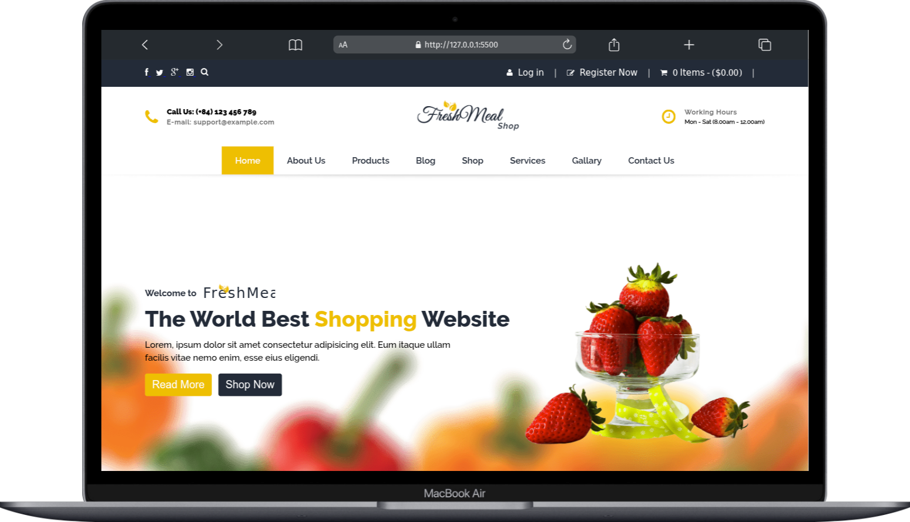

# 🥗 Fresh Meal Shop

A **practice project** built to learn and apply **responsive web design** principles using **HTML5, CSS3, and JavaScript**.  
This project is inspired by [CoderGyan](https://github.com/codersgyan).

## 🚀 Features

- Fully **responsive layout** for desktop, tablet, and mobile.
- **Clean UI/UX** with semantic HTML5 structure.
- **Modern typography** using [Google Fonts](https://fonts.google.com/).
- **SVG icons** for scalability and performance.
- Interactive elements powered by **JavaScript**.

## 🛠️ Technologies Used

- **HTML5**
- **CSS3**
- **Google Fonts**
- **SVG Icons**
- **JavaScript**

## 📂 Project Structure

```txt
Fresh-Meal-Shop/
│── /css
│ └── style.css
│── /fonts
│── /icons
│── /images
│── /js
│ └── app.js
│── index.html
│── LICENSE
└── README.md
```

## 💡 Learning Goals

- Practice **responsive web design** techniques.
- Explore **flexbox** and **grid layout**.
- Gain experience in **designing UI with scalability in mind**.
- Use **JavaScript** for interactivity.

## 📸 Preview

🔗 Click here to see the [Live Demo](https://mms-fresh-meal-shop.vercel.app)


## 📖 How to Use

1. Clone this repository:

   ```bash
   git clone https://github.com/maruf-pfc/fresh-meal-shop.git
   ```

2. Open `index.html` in your browser.
3. Explore and modify the project to learn responsive design.

## 🙌 Acknowledgements

- Inspired by [CoderGyan](https://github.com/codersgyan).
- Thanks to **Google Fonts** and free **SVG icon providers**.

## 📜 License

This project is for **practice and learning purposes only**.
You are free to modify and use it for educational projects.
